# MR.Time——随身时间管家

👨🏻‍💻[Go to Mr.Time!](https://AiGaoShiBOY.github.io/)

📦 [View Scource Code](https://github.com/AiGaoShiBOY/AiGaoShiBOY.github.io)

🐒 **Author：** 1852448 李源峰

## 使用的外部CSS库

🌝 [Font Awesome](http://www.fontawesome.com.cn)

采用Font-awesome 提供了图标支持。其css文件存储在font awesome4.7-4.0中。

## 目录

* [项目简介](#项目简介)
* [功能介绍](#功能介绍)
* [功能展示](#功能展示)
* [核心逻辑](#核心逻辑)
* [开发环境](#开发环境)
* [苹果设备适应](#苹果设备适应)
* [项目结构](#项目结构)

## 项目简介

Mr.Time是一个随身时间管家。它将您的代办事项系统地管理起来，加以不同类型的分类和多样的提示，让您在时间管理上更佳得心应手。它还可以存储一些过去的纪念时刻，并告诉您纪念时刻已经过去了多久，方便您时刻回忆过去的点点滴滴。总之，Mr.Time旨在为用户提供一个方便的、精密的、友好的、交互时间管理工具。

Mr.Time采用纯Html+js+css实现，但是这不妨碍Mr.Time功能丰富。为了方便实现和部署，Mr.Time的数据存储采用浏览器的Local Storage存储，如果您喜欢Mr.Time，建议您不要切换浏览器或者手动清除浏览器数据。

Mr.Time的功能也是易于扩展的，localStorage很好地模拟了与数据库的链接。将Js的相应访问data数据更换为与数据库的交互即可。

Mr.Time是针对移动端设计的。您也可以在PC端使用它，但是移动端能获得最佳的布局体验。

## 功能介绍

### 基本功能

- [x] 新增代办事项
- [x] 删除代办事项
- [x] 展现代办事项列表
- [x] 全部完成
- [x] 删除已完成
- [x] 保存页面状态，刷新页面后可恢复

### 高级功能

- [x] 加入时间系统，包括已过期，倒计时等等功能
- [x] 加入纪念时刻系统
- [x] 最紧急提示
- [x] 时间自动排序
- [x] 加入标签系统
- [x] 加入页面菜单，在菜单中可以过滤当前表项
- [x] 两种编辑途径：编辑按钮一次性更改代办事项所有属性，双击单个属性改变取值
- [x] 严格的输入校验系统
- [x] 菜单、输入单下拉动画
- [x] 向下滑动的提示条交互
- [x] 如果没有代办事项/或者纪念时刻，加入贴心的提示

## 功能展示

### 基本功能

* 代办事项的增加、删除、展现

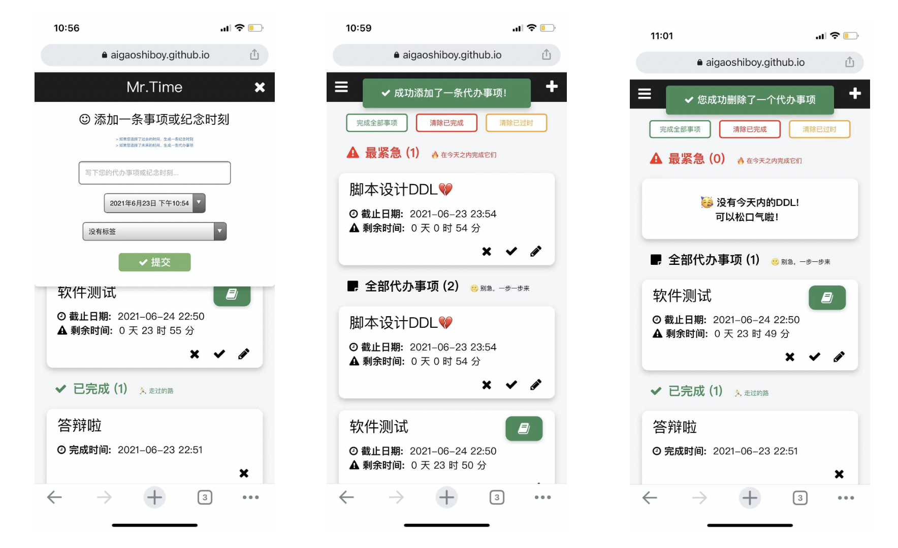

* 全部已完成、删除已完成、删除已过时

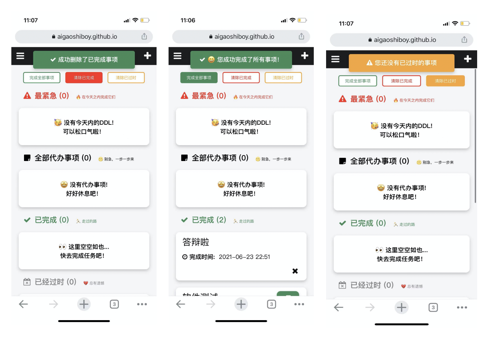

* 数据持久化已经实现，可以点击链接体验

### 高级功能

* Mr.Time在简单的todo系统上加入了时间系统，用户只需要输入截止日期，就能自动看到剩余时间。如果用户超时，过时的代办事项会自动放入已经过时中，用户不需要手动进行操作。Mr.Time对已过时、已完成的事件没有设置编辑功能，只能双击编辑它们的标签，因为这些事件可以随意修改就没有意义了。

  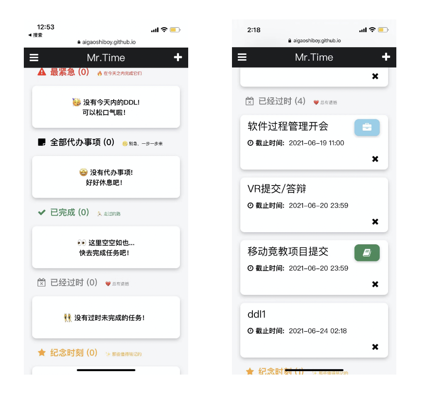

  

* Mr.Time加入了纪念时刻系统，如果用户输入过去的时间，Mr.Time会自动生成纪念事项。纪念事项会显示该天到现在已经过了多久。Mr.Time对纪念时刻设置编辑功能，只能双击编辑它们的标签，因为这些事件可以随意修改就没有意义了。Mr.Time也没有对纪念时刻提供批量删除功能，因为用户误操作的话损失会非常大。

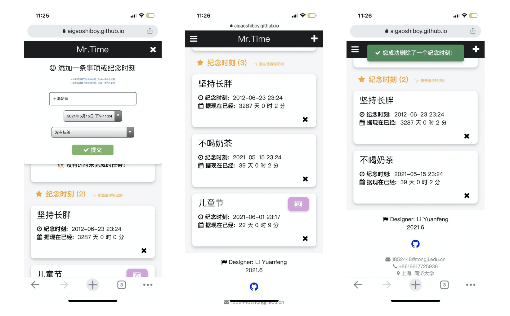

* 自动完成时间排序。其中代办事项、紧急事项、已完成、已过时按照短期——长期排序，纪念时刻按照长期——短期排序。时间排序由重写javascript的sort()函数实现。

  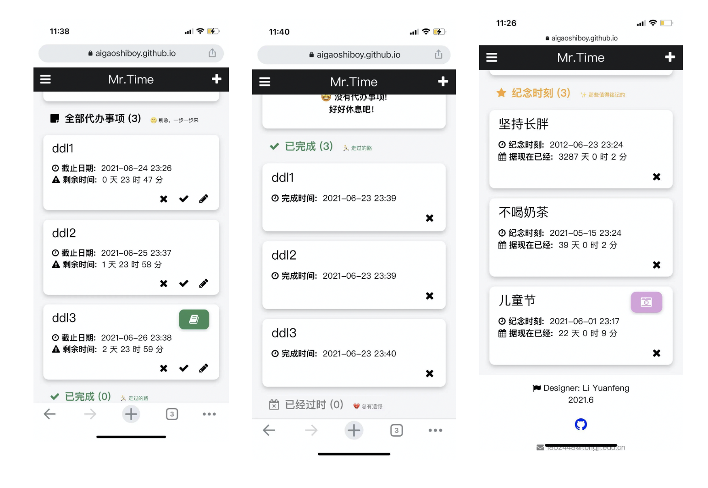

* 加入了紧急提示模块，如果用户的代办事件的截止时间就是今天，会自动加入紧急事件板块。删除/完成时会同时删除代办事项中的相应表项。

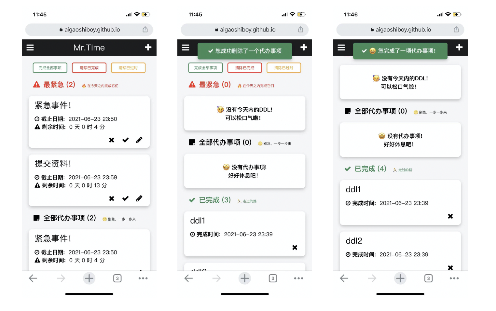

* 标签系统。Mr.Time加入了标签系统，分为学习、工作、运动、生活四个标签。当然懒人党也可以不设置标签，输入的默认值就是不设置标签。

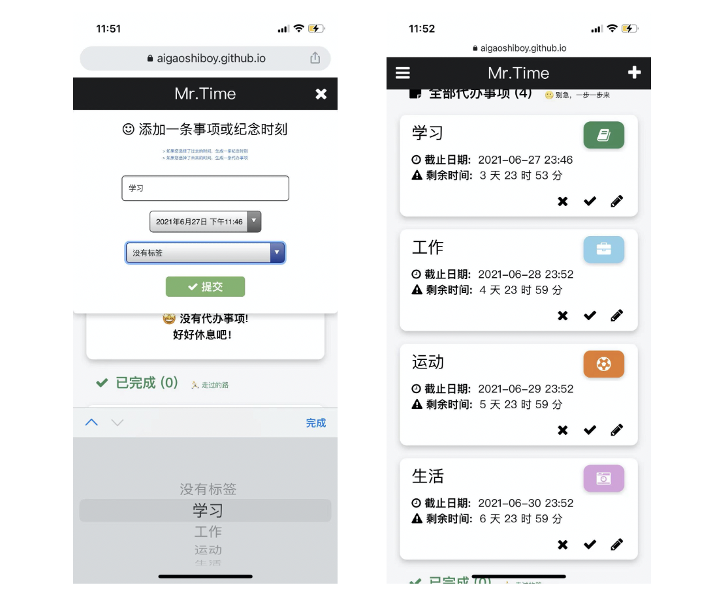

* 菜单系统。一个综合的过滤系统。点击菜单时会有下拉动画呈现。该动画采用css的transition实现。

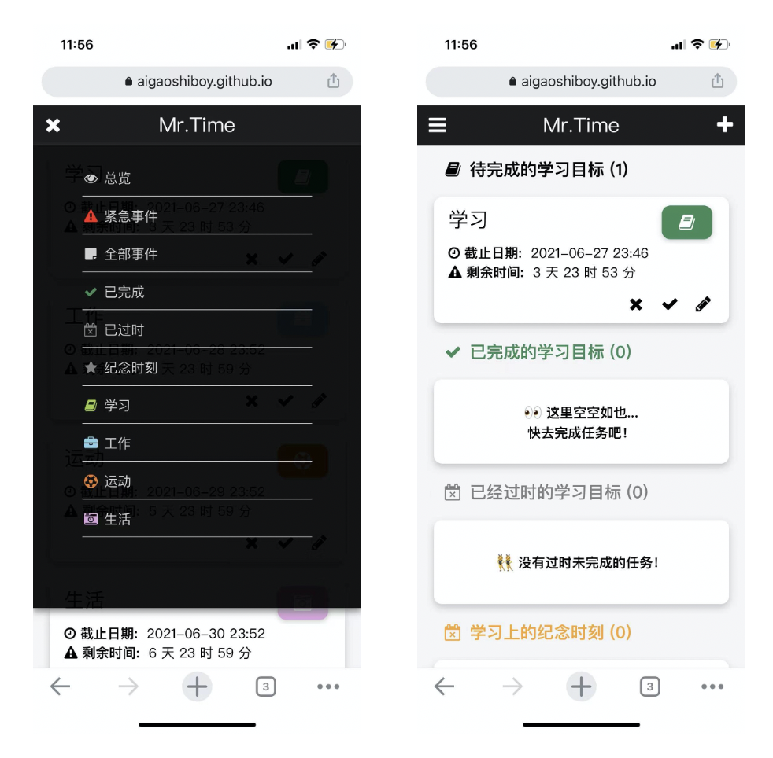

* 两种编辑途径——编辑框和双击编辑。

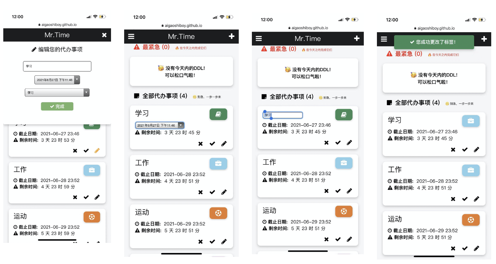

* 完备的输入校验系统。Mr.Time在任何有关输入的地方均会加入全面的表单校验，确保用户正确的输入。Mr.TIme还会在输入中设置一些默认的信息，方便用户使用。

  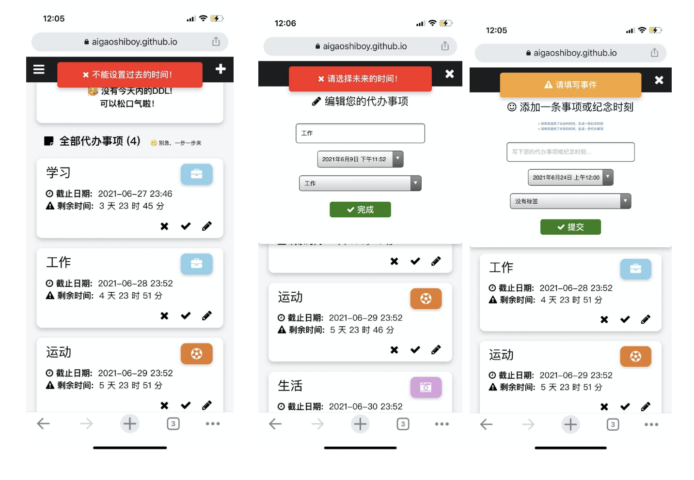

* 下滑的交互系统。通过前面的演示可以看到Mr.Time在任何有关输入的地方均会加入提示框。提示框有success, warning, danger三种。这个提示框会通过设置的CSS动画从顶部滑入页面，并停留在页面一段时间。该功能封装在`showHint()`中

* 如果没有代办事项/或者纪念时刻，加入贴心的提示。对于每种类型的事项，如果事项数为0，Mr.Time都会给出相应的不同提示。不同的提示能够带给用户多样的、友好的交互体验。该功能封装在`setDom()`中

  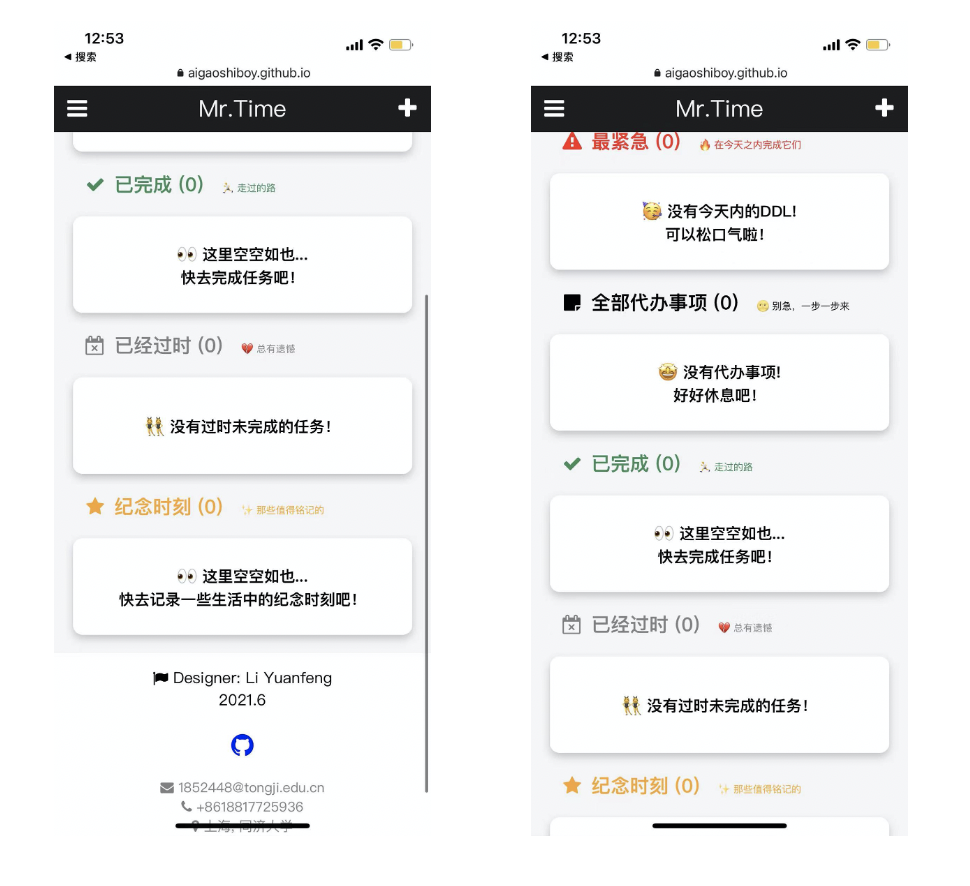

  

## 核心逻辑

### 前后端交互

Mr.py会在全局维护一个data数组，这个数组代表前端的todolist信息。前端数组将通过`loadData()`和`saveData()`两个函数与local storage发生交互。一旦前端数据更新，就会调用`saveData()`存储数据到后端。每次数据存储后，页面都会调用'renderAllTodo()'来重新渲染页面数据，加载数据并重新进行排序，实现数据更新的效果。

### 内容分块

为了便于页面过滤渲染，页面元素按照如下方式分类：

* 基本块

  对应首页五种类的代办事项，id分别为"l1",'l2','l3','l4','l5'.其中1～5代表事项种类，‘l'代表该块位于首页。

* 标签块

* 对应标签页面的过滤结果，其子元素id分别为'x1','y1','z1','t1'，其中''x,y,z,t"代表事项种类，“1～4”代表标签

其余交互功能均在对应函数中进行实现，不同功能对应相应的函数名，绑定相应的组件事件完成对应功能。在此不再赘述，请参阅Index.js。


## 苹果设备适应

由于苹果设备只接受"yyyy/MM/dd"的时间戳，在所有使用Date.parse()的部分均加入了`.replace(/-/g, '/')`函数来使得原本设计的“yyyy-MM-dd"时间戳能够适应苹果设备。加入该转换后，Mr.Time在Safari上可以完全正常运行。


### 前后端交互

## 开发环境

- **开发环境**
  - **开发环境**：macOS 
  - **IDE**：Vscode + chrome
  - **部署工具**: GitHub Pages
- **测试环境**: 
  - Safari on iPhone12
  - Chrome on iPhone 12
  - Chrome Device Simulator
- **开发语言**
  - HTML5
  - CSS3
  - JavaScript


## 项目结构

```
.
├── font-awesome-4.7-4.0
├── css
│   └── index.css
├── index.html
└── js
    └── index.js
```

